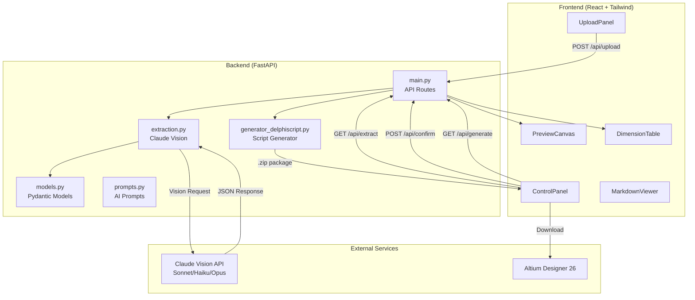
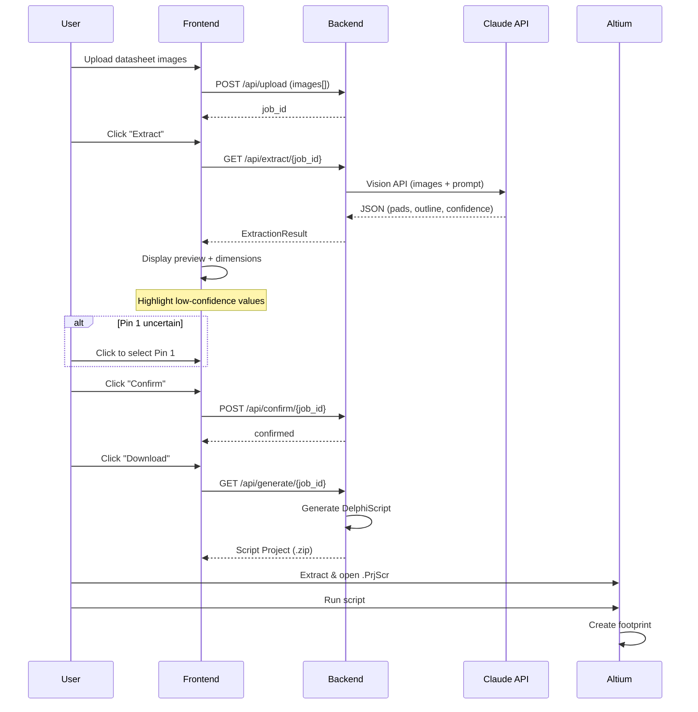

# PRD: AI PCB Footprint Generator

| | |
|---|---|
| **Product Name** | FootprintAI (working title) |
| **Document Owner** | Evan Blasband |
| **Status** | Draft v0.1 → **Implemented v1.0** (2026-02-12) |
| **Target** | Proof of Concept Demo |

---

## Implementation Status Summary

> **This section documents differences between the original PRD and the actual implementation.**

| Feature | PRD Spec | Implementation | Notes |
|---------|----------|----------------|-------|
| Output format | `.PcbLib` ASCII | **DelphiScript (.pas) in Script Project (.zip)** | ASCII .PcbLib doesn't work in Altium 26; DelphiScript uses official API |
| AI Model | Claude Haiku | **Claude Sonnet (default)** | Haiku confused pad width with pitch; Sonnet/Opus available |
| User editing | Editable values | **Confirm only** | Per user interview - MVP is confirm only |
| Through-hole pads | Deferred | **✅ Implemented** | TH round pads + slotted holes supported |
| Thermal pads | Deferred | **Partially implemented** | Basic thermal vias, no paste mask patterns |
| Multiple images | Not specified | **✅ Implemented** | Upload multiple images for better extraction context |
| Preview zoom/pan | Not specified | **✅ Implemented** | Mouse wheel zoom, click-drag pan |
| Documentation tabs | Not specified | **✅ Implemented** | In-app README, PRD, Technical Decisions pages |
| Standard package detection | AI + redirect | **✅ Implemented** | Detects IPC-7351, suggests Altium IPC wizard |

### Key Architectural Differences

1. **File Format**: DelphiScript scripts are generated instead of ASCII .PcbLib files. Users download a Script Project package (.zip) containing `.PrjScr` and `.pas` files, then run the script in Altium to create the footprint.

2. **API Flow**: Added `/api/confirm/{job_id}` endpoint to separate confirmation from generation. The extraction → confirm → generate flow uses job state management.

3. **Model Selection**: Sonnet is the default model. Testing revealed Haiku has accuracy issues with dimension extraction (confuses pitch with pad width).

---

## Executive Summary

A web application that extracts PCB footprint data from component datasheets using AI vision and generates Altium Designer-compatible footprint files. Targets the gap where engineers encounter parts without existing library footprints—particularly custom/non-standard packages—and must manually create them from datasheet drawings.

**MVP Scope:** Single package type (non-standard/custom), image/PDF input, Altium ASCII output, user confirmation of extracted dimensions.

---

## Problem Statement

When an engineer selects a component without an existing PCB footprint:

1. They locate the "Recommended Land Pattern" or "PCB Layout" section in the datasheet
2. They manually interpret dimensional drawings (often inconsistent in format, units, reference points)
3. They create the footprint in their EDA tool pad-by-pad
4. Errors in interpretation → fabrication issues, rework, schedule slip

| Metric | Impact |
|--------|--------|
| **Time cost** | 15-60 minutes per footprint depending on complexity |
| **Error cost** | Incorrect footprint → board re-spin ($5K-50K+ depending on complexity and volume) |
| **Frequency** | Engineers creating 5-20 custom footprints per project is common |

**Why existing solutions fall short:**
- Manufacturer libraries incomplete for newer/custom parts
- IPC-7351 calculators only work for standard packages
- SnapEDA/Ultra Librarian coverage gaps on specialty parts
- Manual creation remains the fallback

---

## Proposed Solution

### High-Level Flow

```
User uploads datasheet image/PDF page(s)
    ↓
System detects if standard IPC-7351 package code present
    ↓
[If standard] → Prompt: "Detected QFN-48. Use IPC calculator, vision extraction, or exit?"
    ↓
[If vision extraction or non-standard] → AI extracts dimensions from drawing
    ↓
Display extracted values for user confirmation/editing
    ↓
User specifies pin names/numbers (AI suggests if context available)
    ↓
Generate Altium ASCII footprint file (.PcbLib or paste-ready)
    ↓
User downloads and imports to Altium
```

### Core Capabilities

**V1 MVP (Original Spec):**
- Image/PDF upload (user-cropped to relevant section)
- Vision-based dimension extraction (pad sizes, positions, pitch, outline)
- User confirmation/edit UI for extracted values
- Pin name/number input (manual, with AI suggestion if datasheet context available)
- Altium ASCII footprint generation (SMD pads, silkscreen outline)
- Download as importable file

**V1 MVP (Actually Implemented):**
- ✅ Multiple image upload (PNG/JPEG/GIF/WebP) with drag-drop, paste (Ctrl+V), and file picker
- ✅ Vision-based dimension extraction via Claude Sonnet (Haiku/Opus also available)
- ✅ User confirmation UI (confirm only, no editing per user interview)
- ✅ Pin 1 selection via interactive canvas click
- ✅ **DelphiScript generation** (not ASCII .PcbLib - see Implementation Status)
- ✅ Script Project package download (.zip with .PrjScr + .pas files)
- ✅ **Through-hole pads** with drill holes (originally deferred)
- ✅ **Basic thermal vias** (originally deferred)
- ✅ 2D preview canvas with zoom/pan and spacing dimensions
- ✅ Confidence highlighting (yellow/orange for low confidence values)
- ✅ Standard package detection with IPC wizard redirect

**Deferred (Still Not Implemented):**
- Full PDF parsing (multi-page search)
- 3D model generation
- Paste mask/courtyard layers (use defaults)
- KiCad/Eagle/OrCAD export
- Batch processing
- **Thermal pad paste mask windowing patterns** — only basic size/position implemented
- **Post-generation DRC:** Pad spacing validation, silkscreen clearance checks
- **IPC-7351C material conditions:** Automatic pad sizing adjustments per IPC spec
- **Value editing** — MVP is confirm-only per user interview

---

## Target Audience

**Primary:** Electrical hardware engineers using Altium Designer who encounter parts without existing footprints.

**Persona:** "Alex the Board Designer"
- Mid-level EE, 3-7 years experience
- Designs 2-4 boards per year
- Comfortable with Altium but not a librarian specialist
- Encounters 5-15 parts per project needing custom footprints
- Pain: Tedious, error-prone manual process; distraction from actual design work

---

## User Stories

### Story 1: Extract Footprint from Datasheet Image
> As Alex, I want to upload a screenshot of a datasheet's land pattern drawing so that I can get a footprint file without manually measuring and entering every dimension.

**Acceptance Criteria:**
- Upload PNG/JPG/PDF (single page)
- System extracts pad dimensions, positions, pitch
- See extracted values in editable form
- Confirm or correct values
- Download Altium-compatible file

### Story 2: Standard Package Detection
> As Alex, I want the system to tell me if the part uses a standard package so that I don't waste time on extraction when I could use Altium's IPC wizard.

**Acceptance Criteria:**
- System detects standard package codes (QFN-XX, SOIC-XX, etc.)
- Prompt with options: use IPC calculator, proceed with extraction, exit
- If user chooses IPC, display relevant parameters for Altium's wizard

### Story 3: Pin Assignment
> As Alex, I want to specify pin names/numbers for the footprint so that the schematic symbol links correctly.

**Acceptance Criteria:**
- UI to enter pin designators (1, 2, 3... or A1, A2, B1...)
- If datasheet context available, AI suggests pin names
- Validate pin count matches extracted pad count

---

## Key Features & Requirements

### 1. Input Processing

| | |
|---|---|
| **Supported formats** | PNG, JPG, PDF (single page) |
| **Assumed input** | User-cropped image containing the land pattern/recommended PCB layout drawing with dimensions |

**Extraction targets:**
- Pad count and arrangement (linear, grid, peripheral)
- Pad dimensions (X, Y or diameter)
- Pad positions (center coordinates or pitch + origin)
- Pad shape (rectangular, rounded-rect, circular, oval)
- Pad type (SMD vs through-hole)
- Drill hole diameter (for TH pads)
- Component outline dimensions (for silkscreen)
- Units (mm, mils, inches) — normalize to mm

### 2. Standard Package Detection

**Method:** Rules-based pattern matching on extracted text + geometry

- Regex on package codes: `QFN, QFP, SOIC, TSSOP, BGA, 0402, 0603, SOT-23, etc.`
- If detected, present option to exit and use Altium's built-in IPC Footprint Wizard

**Rationale:** Avoid AI cost/error for cases where deterministic calculation suffices.

### 3. Vision-Based Extraction

**Model:** Start with Claude Haiku (vision) for cost efficiency. Architecture allows swapping to Sonnet/Opus or GPT-4V if accuracy insufficient.

**Prompt strategy:**
- Structured output request (JSON schema for pad array, dimensions, units)
- Few-shot examples of common drawing formats
- Request confidence scores per extracted value

**Known challenges:**
- Dimension leader lines pointing to wrong features
- Tolerance notations (±0.1) — extract nominal
- Inconsistent datum/origin references
- Mixed units in same drawing
- Rotated or skewed images
- **Dimension chaining:** Datasheets often provide total width + gap + pad width, not individual coordinates. AI must perform geometric reasoning to derive pad centers.
- **Table-variable mapping:** TI/ADI-style datasheets use generic drawings with variables (A, B, C) and lookup tables for package variants. AI must map table values to drawing dimensions.
- **Center-to-center vs edge-to-center:** Dimension reference points vary. Misinterpretation causes half-width offset errors.
- **Pin 1 identification:** Critical. Incorrect Pin 1 orientation renders footprint useless. Must detect Pin 1 markers (dot, chamfer, notch) or infer from pin numbering.

**Mitigation:** User confirmation step catches extraction errors before file generation. Pin 1 orientation gets explicit UI confirmation.

### 4. User Confirmation UI

**Display:**
- Visual preview of extracted footprint (2D pad layout)
- Table of extracted values (editable)
- Overlay on original image showing what was detected
- Warnings for suspicious values (e.g., pad larger than pitch)

**Editable fields:**
- Pad count, dimensions, positions
- Pitch (X and Y)
- Origin reference point
- Units

### 5. Pin Assignment

| | |
|---|---|
| **Input** | Manual entry or paste from spreadsheet |
| **Format** | Pin number → pad position mapping |
| **AI assist** | If full datasheet context provided, attempt to extract pin names from pin description table |

### 6. Footprint Generation

**Output format:** Altium Protel ASCII PCB Library format

**Internal units:** Altium uses 1/10000 mil (1/100,000 inch) internally. Generator must convert from mm.

**Generated elements:**
- SMD pads with correct size, shape, position (rectangular, circular, oval)
- Through-hole pads with drill hole diameter and annular ring
- Silkscreen outline (component boundary)
- Pin 1 indicator (dot or chamfer on silkscreen)
- Designator text placeholder
- Comment text placeholder

**Deferred elements (use Altium defaults post-import):**
- Solder paste mask (expansion/contraction)
- Solder mask expansion
- Courtyard/assembly layers
- 3D body
- Thermal pad paste windowing

**File structure:** Single component in .PcbLib ASCII format, or ASCII primitives for paste operation.

### 7. Export & Download

- Download button generates file
- Filename: `{component_name}_footprint.PcbLib` or `.txt` for paste
- Include README with import instructions

---

## Technical Architecture

### System Architecture Diagram



### User Flow Diagram



### Stack

| Layer | Technology |
|-------|------------|
| **Frontend** | React + Tailwind CSS |
| **Backend** | Python FastAPI |
| **AI** | Anthropic API (Claude Sonnet default, Haiku/Opus available) |
| **Hosting** | Railway (local first) |
| **File generation** | DelphiScript (.pas) generator |

### API Endpoints

**Original Spec:**
```
POST /api/upload
  - Accepts image/PDF
  - Returns job_id

GET /api/extract/{job_id}
  - Returns extracted dimensions (JSON)
  - Includes confidence scores

POST /api/generate
  - Accepts confirmed dimensions + pin mapping
  - Returns footprint file (binary download)

GET /api/detect-standard
  - Accepts extracted text/geometry
  - Returns package classification + IPC parameters if standard
```

**Actually Implemented:**
```
POST /api/upload
  - Accepts multiple images (files[] array)
  - Returns job_id and image_count

GET /api/extract/{job_id}?model=sonnet
  - Runs Claude Vision extraction on all uploaded images
  - Returns extraction result with footprint data
  - Supports model selection: haiku, sonnet, opus

POST /api/confirm/{job_id}
  - Confirms dimensions and Pin 1 selection
  - Body: { pin1_index: number }

GET /api/generate/{job_id}
  - Downloads Script Project package (.zip)
  - Contains .PrjScr and .pas files

POST /api/detect-standard
  - Accepts single image file
  - Returns standard_package detection result

GET /api/job/{job_id}/status
  - Returns job status and metadata

DELETE /api/job/{job_id}
  - Deletes job and associated data

GET /api/docs/{doc_name}
  - Serves markdown documentation
  - doc_name: readme, prd, technical-decisions
```

### Data Flow

```
[Browser] → Upload image → [FastAPI] → Store temp file
                                    → Call Claude Vision API
                                    → Parse response → structured dimensions
                                    → Return to browser

[Browser] → User edits/confirms → [FastAPI] → Generate ASCII footprint
                                           → Return file download
```

### Altium Format (Updated After Spike)

**Original Plan:** ASCII PCB primitives that can be pasted into PcbLib editor.

**Spike Result:** ASCII .PcbLib files open empty in Altium Designer 26. The native format is binary OLE compound document, not ASCII.

**Implemented Solution:** DelphiScript (.pas) files that use Altium's official PCB API:
- `PCBServer.PCBLibraryIterator` - Access library components
- `IPCB_Pad.Create` - Create pad objects with all properties
- `IPCB_Track.Create` - Create silkscreen outline
- `IPCB_Arc.Create` - Create Pin 1 indicator

**Output Format:** Script Project package (.zip) containing:
```
{PartNumber}_ScriptProject.zip
├── {PartNumber}.PrjScr    # Altium Script Project file
└── {PartNumber}.pas       # DelphiScript footprint generator
```

**User Workflow:**
1. Download .zip from web app
2. Extract to local folder
3. Open .PrjScr in Altium Designer 26
4. Create/open a PCB Library document
5. Run script via DXP → Run Script
6. Footprint created in library

**Example DelphiScript pad creation:**
```pascal
Pad := IPCB_Pad(PCBServer.PCBObjectFactory(ePadObject, eNoDimension, eCreate_Default));
Pad.X := MMsToCoord(1.27);
Pad.Y := MMsToCoord(0.0);
Pad.TopXSize := MMsToCoord(0.8);
Pad.TopYSize := MMsToCoord(1.5);
Pad.TopShape := eRectangular;
Pad.Layer := eTopLayer;
Pad.Name := '1';
```

See `technical_decisions.md` TD-001 for full rationale.

---

## Technical Spikes (Pre-Build)

### Spike 1: Altium 26 ASCII Format Validation

| | |
|---|---|
| **Goal** | Confirm ASCII footprint format imports correctly into Altium Designer 26 |
| **Method** | Manually create test footprints (SMD rectangular, SMD oval, through-hole) in ASCII, import into Altium 26, verify pad properties including drill holes |
| **Output** | Documented format spec, working example files for each pad type |
| **Time** | 2-4 hours |

### Spike 2: Vision Model Accuracy Test

| | |
|---|---|
| **Goal** | Assess Claude Haiku's ability to extract dimensions from datasheet drawings |
| **Method** | Run 5-10 sample datasheet images through Haiku, compare extracted values to ground truth |
| **Output** | Accuracy assessment, prompt refinement, decision on model tier |
| **Time** | 4-6 hours |

### Spike 3: Dimension Extraction Prompt Engineering

| | |
|---|---|
| **Goal** | Develop structured prompt that reliably extracts pad geometry |
| **Method** | Iterate on prompt with few-shot examples, test against varied drawing styles |
| **Output** | Production prompt template, JSON schema for response |
| **Time** | 4-8 hours |

---

## MVP Scope Boundaries

### In Scope (Original + Implemented)
- Single footprint extraction per session ✅
- SMD rectangular/circular/oval pads ✅
- Through-hole pads (drill holes, annular rings) ✅ *Originally listed as both in/out scope*
- Mixed SMD/TH footprints ✅ *Basic support*
- User-cropped input (no full PDF search) ✅
- Manual pin naming with optional AI suggestion ✅ *Pin 1 selection only in MVP*
- **DelphiScript output** ✅ *Changed from "ASCII output" after spike*
- Web UI (no API-only mode) ✅
- Multiple image upload for better extraction context ✅ *Added during implementation*
- Preview canvas with zoom/pan ✅ *Added during implementation*
- Confidence highlighting for uncertain values ✅

### Out of Scope (Future)
- Full PDF parsing and page detection
- Batch processing multiple parts
- 3D model generation
- KiCad, Eagle, OrCAD export
- Paste mask/courtyard layer customization
- Direct Altium plugin integration
- User accounts/saved footprints
- **Value editing** (confirm only in MVP per user interview)

---

## Non-Functional Requirements

**Deterministic output:** Same input image + same confirmed dimensions must produce identical output file. No randomness in generation.

**Error states:** Clear UX for failure modes:
- "Could not detect any dimensional information" → prompt manual entry fallback
- "Multiple land patterns detected" → prompt user to select
- "Units ambiguous" → prompt user confirmation
- "Pin 1 marker not found" → require explicit user designation

**Processing latency:** Extraction + generation < 60 seconds for typical input.

**Security:** Uploaded datasheets processed in-memory, not persisted beyond session. No logging of proprietary content.

---

## Success Criteria

### Demo Success (MVP)
- End-to-end flow working: upload → extract → confirm → download → import to Altium
- At least one non-standard package type extracts correctly >70% of time
- Generated footprint imports into Altium without errors
- Extraction + generation completes in <60 seconds

### Accuracy Targets
- Dimension extraction within 0.05mm of ground truth for >70% of values
- Pad count correct 100% of time (user can verify/fix)
- User confirmation step catches remaining errors

---

## Risks & Mitigations

| Risk | Likelihood | Impact | Mitigation |
|------|------------|--------|------------|
| Vision model misreads dimensions | High | High | User confirmation UI; prompt engineering; model upgrade path |
| Altium ASCII format undocumented/fragile | Medium | High | Spike 1 validates before build; fallback to script generation |
| Varied datasheet drawing styles | High | Medium | Start with single style; expand prompt examples over time |
| Units confusion (mm vs mils) | Medium | High | Explicit unit detection; user confirmation; sanity checks |
| Complex pad shapes (custom outlines) | Low | Medium | MVP: rectangular/circular only; defer custom shapes |

---

## Open Questions (Resolved)

1. **Altium version targeting:** ✅ Altium Designer 26 (confirmed, tested)
2. **Example datasheets:** ✅ 5 examples in `example_datasheets/` folder
3. **Ground truth footprints:** ✅ In `documents/` folder - validated against SO-8EP
4. **Cost ceiling:** ✅ ~$0.002-0.004 per extraction with Sonnet (well under $0.01 target)
5. **Error handling UX:** ✅ Error messages displayed, Reset button to start over

## Remaining Open Questions

1. **Complex connector support:** Vision models struggle with high-pad-count connectors (M.2, USB 3.0). Consider hybrid approach?
2. **Slotted holes:** API property for slot length unclear - needs verification in Altium
3. **Rounded rectangle pads:** AD26 constant causes crashes - using rectangular fallback

---

## Implementation Plan

### Phase 0: Spikes (Day 1) ✅ COMPLETE
- [x] Spike 1: Altium format validation → **Result: ASCII .PcbLib doesn't work, pivoted to DelphiScript**
- [x] Spike 2: Vision model accuracy test → **Result: Sonnet recommended over Haiku**
- [x] Spike 3: Prompt engineering → **Included in Spike 2**

### Phase 1: Backend Core (Days 1-2) ✅ COMPLETE
- [x] FastAPI scaffold with Pydantic models
- [x] Multi-image upload endpoint
- [x] Claude Vision integration (Sonnet/Haiku/Opus)
- [x] Dimension extraction pipeline with confidence scoring
- [x] **DelphiScript generator** (pivoted from ASCII .PcbLib)
- [x] Script Project package generation (.zip)
- [x] 186 unit tests passing

### Phase 2: Frontend (Day 2) ✅ COMPLETE
- [x] Upload UI with drag-drop, paste, multi-image support
- [x] Extraction results display with confidence highlighting
- [x] Confirmation form (confirm only, no editing per user interview)
- [x] Visual footprint preview with zoom/pan
- [x] Pin 1 interactive selection
- [x] Download flow with part number naming
- [x] Documentation tabs (README, PRD, Technical Decisions)

### Phase 3: Integration & Polish (Day 3) ✅ COMPLETE
- [x] End-to-end testing with Altium Designer 26
- [x] Error handling and user-friendly messages
- [ ] Deploy to Railway (pending)
- [x] Documentation/README

### Phase 4: Validation (Ongoing)
- [x] Test SO-8EP - ✅ Works well with Sonnet
- [ ] Test RJ45 - Partial (complex TH)
- [ ] Test USB 3.0 - Limited (slots)
- [ ] Test M.2 Mini PCIe - Limited (high pad count)
- [ ] Test Samtec HLE - Limited (mixed SMD/TH)
- [x] Import generated footprints into Altium - ✅ Verified working
- [ ] Record demo

---

## Future Roadmap

| Version | Features |
|---------|----------|
| **V1.1** | Full PDF parsing (find land pattern page automatically) |
| **V1.2** | KiCad export |
| **V2.0** | Batch processing, user accounts, saved library |
| **V2.1** | Direct EDA tool plugin (Altium extension) |
| **V3.0** | 3D model generation from package drawings |

---

## Appendix A: Altium Import Methods

### Method 1: ASCII Paste ❌ DOES NOT WORK
*Tested: ASCII .PcbLib files open empty in Altium Designer 26*

### Method 2: Script Import ✅ IMPLEMENTED
1. Extract downloaded Script Project (.zip)
2. Open `.PrjScr` file in Altium Designer 26
3. Open/create a PCB Library document
4. DXP → Run Script → Select procedure
5. Footprint created in library

### Method 3: PcbLib File ❌ DOES NOT WORK
*Native .PcbLib format is binary OLE compound document, not ASCII*

**Spike Result:** Method 2 (DelphiScript) is the only reliable approach.
See `technical_decisions.md` TD-001 for details.

---

## Appendix B: Example Extraction Schema

```json
{
  "package_type": "custom",
  "standard_detected": null,
  "units": "mm",
  "pad_count": 8,
  "pad_shape": "rectangle",
  "pads": [
    {"index": 1, "x": -1.75, "y": 1.25, "width": 0.6, "height": 1.0},
    {"index": 2, "x": -1.75, "y": 0.0, "width": 0.6, "height": 1.0},
    ...
  ],
  "outline": {
    "width": 5.0,
    "height": 4.0,
    "origin": "center"
  },
  "confidence": {
    "pad_dimensions": 0.85,
    "pad_positions": 0.78,
    "outline": 0.92
  }
}
```

---

## Appendix C: Competitive/Alternative Landscape

| Tool | Coverage | Gap |
|------|----------|-----|
| SnapEDA | Large library | Missing custom/new parts |
| Ultra Librarian | Large library | Same coverage gap |
| Altium Content Vault | Growing | Incomplete |
| IPC-7351 Wizard (Altium) | Standard packages only | No custom support |
| Manual Creation | Universal | Time-consuming, error-prone |

**This tool targets the gap:** Parts not in existing libraries, non-standard packages, new components.
